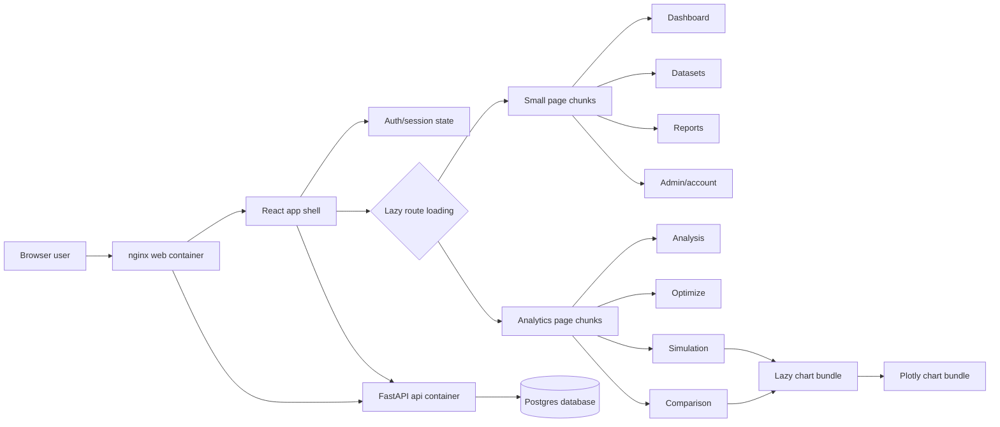

# NovaQ — Queueing Analytics

[](https://github.com/axcelljunsecondez-commits/qcu-queueing-dashboard/actions/workflows/ci.yml)

Production queueing-analytics platform for analyzing service queues with M/M/1, M/M/c, M/G/c, M/M/c/K, M/G/c/K, and M/M/c+M (Erlang-A) models. A React SPA (served by nginx) talks to a FastAPI + Postgres backend that computes current metrics, optimized staffing, DES + Monte Carlo validation, scenario comparison, and PDF/Excel reports.

## Features

- Role-based web app (admin/analyst) with session authentication and CSRF protection.
- Upload CSV or XLSX queue data; store datasets and scenarios in Postgres.
- Compute utilization, queue length, waiting time, and system time per segment.
- Recommend staffing changes based on utilization and cost (server, wait, abandonment).
- Validate optimized plans with discrete-event simulation (SimPy) and Monte Carlo (default 2K trials, up to 100K).
- Compare scenarios and export PDF/Excel reports.
- English and Filipino (tl) localization.

**Separate cashier queues:** Current is analysed per queue with the models above. Staffing and break plans are evaluated with a replicated routing simulation that has no finite capacity and no abandonment. Analytical Current and simulated plan values are shown side by side with their basis labelled; savings and ROI are not computed across the two bases.

## Architecture

| Component | Tech | Endpoint |
|---|---|---|
| `web` | nginx serving the built React SPA, proxying `/api/` | http://localhost |
| `api` | FastAPI + SQLAlchemy (Postgres), argon2 sessions | :8000 (via nginx) |
| `db` | PostgreSQL 16 | :5432 |



The first screen loads the small React shell first. Chart-heavy pages load only
when the user opens Simulation or Comparison, and those pages share the Plotly
chart bundle.

## Quick Start (Docker)

Requires Docker Desktop (or any Docker engine).

```powershell
docker compose up -d --build
```

Then open **http://localhost**. The local compose defaults create this admin account:

```text
email:    admin@example.com
password: admin123
```

For any shared demo or deployment, copy `.env.example` to `.env` and set a strong
`ADMIN_PASSWORD` before starting the stack. Keep `SECURE_COOKIES=0` only for local
`http://localhost`; use `SECURE_COOKIES=1` behind HTTPS/TLS.

The API is reachable directly at `http://localhost:8000` only in local development
and is proxied through nginx at `http://localhost/api/*`. Production publishes
only NovaQ nginx on `127.0.0.1:8080`; API and PostgreSQL remain private.

Stop the stack:

```powershell
docker compose down
```

## Frontend Development

```powershell
cd frontend
npm install
npm run dev
```

The Vite dev server runs at **http://localhost:5173** and proxies `/api` to `http://localhost:8000` (with the API running via Docker or `uvicorn backend.api.main:app`).

## Registration, email, and Google Sign-In

Public accounts are created as unverified analysts and cannot sign in until they
follow the emailed verification link. Verification and password-reset secrets
are stored only as SHA-256 digests and are submitted from URL fragments so they
do not appear in ordinary request URLs. Password and Google authentication both
create the same opaque NovaQ session and resolve to the same `users.id`.

Local development defaults to `EMAIL_DELIVERY_MODE=console`; verification and
reset messages appear in API logs. Production requires SMTP and HTTPS settings.
Copy the placeholders from `.env.example` and set `PUBLIC_APP_URL`, `SMTP_HOST`,
`SMTP_FROM_EMAIL`, and any SMTP credentials without committing them.

To enable Google Identity Services, create a Google OAuth 2.0 **Web application**
client, add the exact NovaQ origin (for example `https://novaq.example.com`) to
Authorized JavaScript origins, then set:

```text
GOOGLE_SIGN_IN_ENABLED=1
GOOGLE_CLIENT_ID=<web-client-id>.apps.googleusercontent.com
```

No Google client secret, access token, refresh token, Drive, Gmail, or Calendar
scope is used. The backend verifies ID-token signatures, audience, issuer,
expiry, verified email, subject, and a five-minute single-use nonce.

## Production deployment

Production uses `docker-compose.production.yml` behind an external TLS reverse
proxy. Database, SMTP, and bootstrap-password secrets are read from restrictive
files outside the repository. The Compose dependency chain runs one migration
job and one create-only administrator bootstrap before API readiness; those
credentials are not present in the long-running API container.

Do not deploy directly from a dirty working tree. Review and commit every required
migration, runtime source, lock file, nginx configuration, and operations script.
Follow `docs/operations.md` for preflight, backup confirmation, deployment,
TLS/proxy configuration, smoke tests, rollback, recovery, monitoring, and the
operator evidence required for a public GO decision.

## Backend Development

```powershell
python -m venv .venv
.\.venv\Scripts\Activate.ps1
python -m pip install -r requirements.txt
uvicorn backend.api.main:app --reload --port 8000
```

## Input Data

Required columns:

| Column | Description |
| --- | --- |
| `time` | Time segment label, such as `08:00-09:00` |
| `lambda` | Arrival rate per time unit |
| `mu` | Service rate per server per time unit |
| `c` | Number of servers |

Optional columns:

| Column | Description |
| --- | --- |
| `variance` | Service-time variance for M/G/c analysis |
| `K` | Total system capacity for finite-capacity models |
| `theta` | Abandonment rate for M/M/c+M (Erlang-A) |

`K` means the maximum number of customers allowed in the whole system:

```text
K = customers being served + customers waiting
```

For example, if `c = 3` and `K = 10`, then 3 customers can be served and up to 7 can wait. Additional arrivals are blocked.

## Model Selection

The app chooses the model per row using these rules (single source of truth: `backend/queueing_engine/services/model_selection.py`):

| Inputs | Model |
| --- | --- |
| `theta > 0` | M/M/c+M (Erlang-A) |
| `variance` and `K` present | M/G/c/K |
| `K` present, no `variance` | M/M/c/K |
| `variance` present, no `K` | M/G/c |
| `c = 1`, no `variance`, no `K` | M/M/1 |
| otherwise | M/M/c |

For finite-capacity rows, `K` must be greater than or equal to `c`.

## Key Metrics

- `rho`: server utilization
- `Lq`: average queue length
- `Wq`: average waiting time in queue (minutes in reports/UI)
- `L`: average number of customers in system
- `W`: average time in system

## Stability Rules

- M/M/1: `lambda < mu`
- M/M/c and M/G/c: `lambda < c * mu`
- M/M/c/K and M/G/c/K: finite-capacity systems are bounded, but high offered load increases blocking probability.

Rows that violate the stability condition are marked unstable and should be adjusted before relying on the reported queue metrics.

## Tests

Backend (matches CI invocation):

```powershell
python -m pytest tests/ -x --tb=short
```

Lint and type checks:

```powershell
ruff check .
mypy .
```

Frontend:

```powershell
cd frontend
npm test
npm run typecheck
npm run lint
npm run build
```

Tests cover queue formulas, optimization logic, DES/Monte Carlo simulation, cost analysis, the API (auth, datasets, scenarios, reports, admin), and the React UI.

## Result integrity and deployment

See [operations and analytical boundaries](docs/operations.md) for production
configuration, supported Python versions, snapshot semantics, simulation coverage,
backup verification, and limits of financial/staffing estimates.
